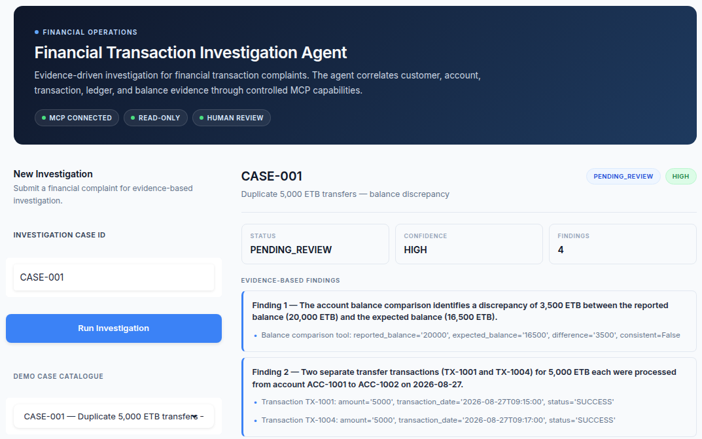
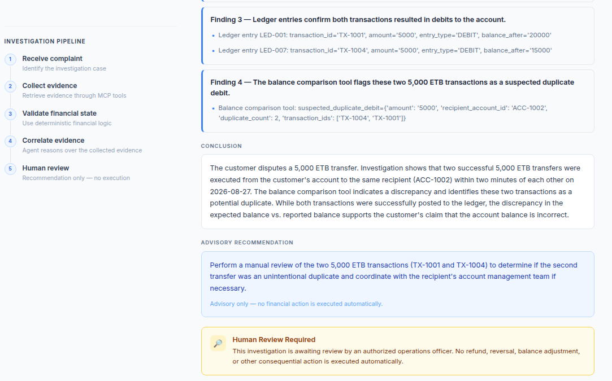

# Financial Transaction Investigation Agent

> **An agentic workflow that helps financial operations officers investigate customer transaction complaints by gathering and correlating evidence through controlled MCP capabilities—while keeping financial logic deterministic and final decisions under human authority.**

---

## Why This Problem?

Financial operations teams regularly handle customer complaints such as:

* “I was charged twice.”
* “My transfer failed, but my balance decreased.”
* “The recipient received the money, but my account still looks wrong.”
* “A reversed transaction did not restore my balance.”

Investigating these complaints is rarely a matter of checking a single record.

The relevant evidence may be distributed across:

* customer records;
* account information;
* transaction history;
* ledger entries; and
* calculated account balances.

An operations officer must identify which evidence matters, correlate records across these sources, detect inconsistencies, and determine what should be reviewed next.

The bottleneck is therefore **evidence correlation and investigation effort**, not simply data retrieval.

This project explores whether an agent can make financial investigations more systematic and reduce the effort required to correlate evidence, while keeping financial correctness and consequential decisions outside the LLM.

---

# The Solution

The **Financial Transaction Investigation Agent** acts as an investigation coordinator.

It retrieves evidence through a fixed sequence of MCP calls, then supplies the complaint and evidence to an LLM for correlation and a structured investigation report. Tool selection is controlled by application code, not by the model.

The architecture deliberately separates **probabilistic reasoning** from **deterministic financial logic**.

```text
Customer Complaint
        │
        ▼
Investigation Agent
        │
        │ Collect evidence in a fixed sequence
        ▼
    MCP Client
        │
        │ Streamable HTTP (Compose)
        ▼
    agentgateway
        │ Strict authentication + tool allowlist
        ▼
    MCP Server
        │
        ├── get_customer
        ├── get_account
        ├── get_transactions
        ├── get_ledger_entries
        └── compare_account_balance
        │
        ▼
Deterministic Business Services
        │
        ▼
Synthetic Financial Data
```

Financial evidence is retrieved through MCP tools and deterministic services.
Case metadata is loaded through the existing investigation service; LLM reasoning
does not query the database. Outside Compose, the default MCP client connects to
an in-process server without the gateway.

```text
Agent reasoning
      ↓
MCP capability
      ↓
Business service
      ↓
Financial data
```

This creates a clear boundary between what the agent can reason about and what the financial system is allowed to determine.

---

# Investigation Workflow

The investigation combines a deterministic evidence-collection workflow with
LLM analysis. It is not an autonomous tool-selection loop.

```text
Complaint
    ↓
Load investigation case
    ↓
Gather evidence through five predefined MCP calls
    ↓
Correlate and analyze evidence
    ↓
Generate findings
    ↓
Generate recommendation
    ↓
Human checkpoint
```

The agent can:

* interpret an unstructured complaint;
* analyze the evidence supplied by the predefined MCP workflow;
* correlate customer, account, transaction, and ledger information;
* identify inconsistencies and potential anomalies; and
* produce evidence-backed findings and recommendations.

The project intentionally uses **one investigation agent** rather than adding multiple agents or orchestration frameworks simply for complexity.

The goal is to demonstrate useful agentic behavior while keeping the system understandable, auditable, and safe.

---

# Example Investigation

## Customer Complaint

> “I transferred 5,000 ETB yesterday, but my account balance is wrong.”

The agent investigates the relevant account and retrieves transaction, ledger, and balance evidence.

### Example Finding

```text
Finding:

Potential duplicate debit of 5,000 ETB.

Evidence:

- TX-1001 and TX-1004 are both successful 5,000 ETB transfers.
- Both transfers were made to ACC-1002.
- The transactions occurred within two minutes.
- Separate debit ledger entries exist for both transactions.
- The deterministic balance comparison reports a discrepancy.

Recommendation:

Perform manual reconciliation and verify whether both
transfers were authorized by the customer.
```

The agent does **not** decide whether a refund or reversal should occur.

The resulting case status is:

```text
PENDING_REVIEW
```

The case is then passed to an authorized operations officer.

---

# Financial Safety Boundary

This is an **investigation assistant**, not an autonomous financial decision-maker.

The LLM is not responsible for:

* calculating balances;
* determining authoritative financial state;
* posting transactions;
* issuing refunds;
* performing reversals;
* modifying accounts; or
* making the final consequential decision.

Financial calculations and business rules remain deterministic.

The agent can recommend an action, but **a qualified human must make the final decision**.

```text
INVESTIGATE
     ↓
CORRELATE EVIDENCE
     ↓
EXPLAIN FINDINGS
     ↓
RECOMMEND
     ↓
HUMAN REVIEW
     ↓
FINAL DECISION
```

No consequential financial action is automatically executed by the system.

---

# MCP Capabilities

The agent operates through read-only MCP capabilities:

| MCP Tool                  | Purpose                                  |
| ------------------------- | ---------------------------------------- |
| `get_customer`            | Retrieve customer information            |
| `get_account`             | Retrieve account information             |
| `get_transactions`        | Retrieve account transactions            |
| `get_ledger_entries`      | Retrieve ledger evidence                 |
| `compare_account_balance` | Perform deterministic balance comparison |

MCP provides the controlled capability boundary between the agent and financial services.

The MCP layer does not expose financial write operations.

The implementation reuses [McpClient](app/mcp/client.py) and
[create_mcp_server](app/mcp/server.py), backed by MCP Python SDK **2.2.0**.
The client uses MCP tool discovery and calls, not the REST tool-testing routes.
Those REST routes are disabled in gateway mode.

## MCP, agentgateway, and AGENTS.md

| Component | Role in this repository |
| --- | --- |
| MCP | Protocol connecting the investigation workflow to five read-only financial tools. |
| agentgateway **v1.5.0** | Runtime proxy enforcing strict Basic authentication and the tool allowlist in Compose, with no direct-access fallback. |
| [AGENTS.md](AGENTS.md) | Development instructions for coding assistants: preserve architecture, financial safety, testing discipline, and evaluation integrity. |

These roles are distinct: AGENTS.md is not a runtime prompt or security control,
and MCP alone does not supply operator authorization. Adoption does not imply
AAIF certification or production readiness. See [gateway setup](#agentgateway)
and [coding-agent guidance](#coding-agent-instructions).

---

# Structured Results

Agent results use structured Pydantic models rather than unconstrained text.

## Investigation Result

```text
InvestigationResult

├── case_id
├── findings
│   ├── description
│   └── evidence
├── conclusion
├── confidence
│   └── HIGH | MEDIUM | LOW
├── recommendation
├── requires_human_review
└── status
    └── PENDING_REVIEW
```

The application enforces:

```text
requires_human_review = True
status = PENDING_REVIEW
```

in application code, independently of the LLM response.

This prevents the model from bypassing the human-review boundary through its generated output.

---

# Investigation Trajectories

Every evaluation investigation produces a trajectory that records how the investigation was executed.

A trajectory captures:

* workflow start, including the investigation objective and instructions;
* case retrieval;
* each MCP tool call, including parameters and return values;
* prompt-construction metadata identifying evidence sources, not raw prompt text;
* LLM request and response confirmation;
* result validation;
* the mandatory `human_checkpoint` event; and
* the final validated investigation result.

MCP retry events are recorded **only when an actual retry occurs**. They are not artificially inserted into successful trajectories.

All 20 evaluation trajectories are stored under:

```text
evaluation/results/trajectories/
```

Each file is named:

```text
CASE-NNN.json
```

and contains the recorded investigation steps from workflow start through the human checkpoint and final validated result.

Customer PII is sanitized before trajectories are persisted.

Investigation identifiers such as `customer_id`, `account_id`, and `transaction_id` are preserved for traceability.

---

# Evaluation

The project uses a deterministic baseline and evaluates both systems against the **same 20 synthetic investigation cases**.

The evaluation set includes:

* normal incoming and outgoing transactions;
* failed transactions;
* reversed transactions;
* duplicate-looking transactions;
* multi-transaction investigations; and
* inconsistent account and ledger states.

The evaluation measures whether the agent reaches the expected investigation outcome against the same deterministic reference used by the baseline.

The goal is not simply to produce plausible investigation narratives.

> **The evaluation measures whether the agent reaches the expected investigation outcome, not simply whether it produces a plausible narrative.**

## Evaluation Results

| System                 | Correct | Accuracy |
| ---------------------- | ------: | -------: |
| Deterministic baseline | **20 / 20** | **100%** |
| Investigation agent    | **17 / 20** | **85%** |

Across the 108 evaluated criteria, the agent satisfied 103 criteria, achieving an overall criteria-level score of **95.4%**.

At the case level, it produced the expected investigation outcome for **17 of 20 cases (85%)**.

These are two different evaluation views:

- **Criteria level:** 103 / 108 (95.4%) measures individual evaluation criteria across all 20 cases.
- **Case level:** 17 / 20 (85%) measures whether the complete investigation outcome for each case was correct.

## Agent Failure Cases

| Case     | Score | Failing Criterion                 |
| -------- | ----: | --------------------------------- |
| CASE-005 |   86% | Identifies outgoing transfer      |
| CASE-018 |   75% | Identifies TX-1002 and TX-1003    |
| CASE-019 |   71% | Identifies TX-1001 and TX-1003    |

The deterministic baseline currently outperforms the agent on correctness.

That result is important.

The project does **not** claim that adding an LLM automatically improves financial investigation accuracy.

Instead, the experiment evaluates where an agent can provide value beyond deterministic rules:

* interpreting complaints;
* analyzing the collected evidence;
* correlating information;
* explaining relationships between records; and
* reducing investigation effort.

Detailed evaluation cases and results are available under:

```text
evaluation/
```

---

# Hot Take / Insights

> **An agent should not be trusted simply because it can reason across more evidence. In financial workflows, adaptive reasoning is valuable, but every reasoning step can also introduce error.**

The evaluation demonstrated this directly:

```text
Deterministic baseline: 20/20  (100%)
Investigation agent:    17/20   (85%)
```

The **17/20 versus 20/20** result is part of the project's evidence—not something to hide.

It demonstrates where probabilistic reasoning can help and where deterministic authority is still required.

## Where the Agent Adds Value

The agent is useful when the task requires:

* interpreting ambiguous or unstructured complaints;
* deciding which evidence is relevant;
* working with evidence retrieved through permitted capabilities;
* correlating evidence across multiple sources;
* explaining relationships between records; and
* producing an investigation narrative for a human reviewer.

## Where Deterministic Software Should Remain Authoritative

When correctness can be explicitly defined and tested, deterministic software should own the decision.

That includes:

* financial calculations;
* balance comparison;
* reconciliation rules;
* transaction and ledger logic; and
* financial state changes.

## Main Failure Mode

The agent can produce an incorrect investigation result even when the underlying evidence is available.

The three failing cases — **CASE-005, CASE-018, and CASE-019** — involved evidence that was present in the tool responses but was not correctly identified or attributed in the LLM output.

The response to an agent failure should **not** be to give the agent more financial authority.

Instead, the system limits the consequences of probabilistic reasoning through:

1. controlled MCP capabilities;
2. deterministic financial services;
3. structured output validation;
4. evidence-backed findings;
5. trajectory recording;
6. mandatory human review; and
7. no autonomous consequential actions.

## The Lesson

> **Use agents where adaptation and evidence correlation matter. Use deterministic software where correctness can be explicitly defined. Keep consequential authority with qualified humans.**

---

# Improvement Changelog

The project was developed incrementally rather than starting with the final architecture.

| Stage           | What Changed                                                                                                      | Evidence / Learning                                                         | Decision                                                                  |
| --------------- | ----------------------------------------------------------------------------------------------------------------- | --------------------------------------------------------------------------- | ------------------------------------------------------------------------- |
| **Baseline**    | Built a deterministic investigation baseline using the same synthetic cases                                       | **20/20 — 100%**                                                            | Established a strong correctness reference                                |
| **Iteration 1** | Introduced an LLM-based investigation workflow                                                                    | Agent could interpret investigation context and produce structured analysis | Kept the agent for reasoning and coordination                             |
| **Iteration 2** | Added controlled MCP capabilities for customer, account, transaction, and ledger evidence                         | Separated agent reasoning from direct database access                       | Kept                                                                      |
| **Iteration 3** | Added deterministic balance comparison                                                                            | Financial calculations no longer depended on LLM reasoning                  | Kept                                                                      |
| **Iteration 4** | Added structured Pydantic investigation results                                                                   | Reduced unconstrained agent output                                          | Kept                                                                      |
| **Iteration 5** | Added mandatory human checkpoint enforcement                                                                      | Prevented the agent from becoming an autonomous financial decision-maker    | Kept                                                                      |
| **Iteration 6** | Added trajectory recording and genuine MCP retry tracking                                                         | Made agent behavior and failures auditable                                  | Kept                                                                      |
| **Final**       | Added case-time evidence, versioned artifacts, auditable outputs, and corrected evaluation criteria | **17/20 — 85%** agent case accuracy | Keep the agent as an investigation coordinator, not a financial authority |
| **MCP transport** | Updated to MCP Python SDK 2.2.0 and added agentgateway v1.5.0 in Compose | Isolated gateway tests cover authentication, tool restrictions, evidence parity, outage behavior, and read-only database access | Reuse the existing tools and services; keep financial rules unchanged |
| **Coding guidance** | Adopted root [AGENTS.md](AGENTS.md) | Documents repository scope, safety boundaries, and validation requirements | Guide coding assistants without treating instructions as runtime enforcement |

### Removed Experiment

The project deliberately avoids unnecessary multi-agent orchestration.

Where multi-agent orchestration was considered as an architectural direction, the final design retained a single investigation agent because additional orchestration was not necessary to demonstrate the core problem or improve the investigation objective.

The final architecture therefore focuses on:

> **One investigation agent + controlled MCP capabilities + deterministic business logic + structured results + mandatory human review.**

The most important architectural improvement was not adding more agents.

It was **separating adaptive reasoning from authoritative financial logic**.

---

# Reproducibility

The project uses synthetic financial data so the evaluation can be reproduced without exposing customer information.

A new evaluator should be able to:

1. start the application;
2. run the deterministic baseline;
3. run the investigation agent;
4. evaluate the same 20 cases;
5. inspect the results; and
6. inspect the corresponding trajectories.

---

# Requirements

* Python 3.11+
* Docker / Docker Compose
* `uv`
* A Gemini API key for live agent investigations/evaluation (not routine tests)
* Apache `htpasswd` for creating gateway credentials when using Compose

---

# Setup

Clone the repository:

```bash
git clone <repository-url>

cd financial-transaction-investigation-agent
```

Create the environment file only if it does not already exist:

```bash
cp -n .env.example .env
```

Configure the required values:

```env
DEFAULT_LLM_PROVIDER=gemini
GEMINI_API_KEY=your_api_key
GEMINI_MODEL=gemini-2.5-flash
```

Before starting Compose, configure the gateway credentials below. For local
test and evaluation commands, install the project dependencies with `uv sync`.

## Agentgateway

Compose routes financial evidence calls through agentgateway **v1.5.0** using
MCP Python SDK **2.2.0** and Streamable HTTP:

```text
Investigation -> McpClient -> agentgateway -> MCPServer -> Services -> SQLite
```

The existing five tools, financial rules, and database schema are unchanged.
The API initializes/seeds the existing `banking-data` volume; the MCP service
starts after API health succeeds and mounts the same volume read-only. Only
agentgateway shares the MCP backend network with that service.

The database singleton now honors `DATABASE_PATH`. Earlier versions ignored
that setting and could store data at `/app/core_banking.db` inside the API
container rather than the volume. Before recreating an existing deployment,
back up and inspect that file and the volume. This change does not migrate or
delete either database; an empty configured database is seeded with synthetic data.

### Credentials and Startup

Create a bcrypt htpasswd file using Apache's `htpasswd` utility. Enter a strong,
unique password at its prompt; do not put the password in shell arguments:

```bash
mkdir -p .secrets
htpasswd -cB .secrets/agentgateway.htpasswd investigation
```

Use `-c` only for initial creation; omit it when updating an existing file.
Set `MCP_GATEWAY_PASSWORD` in your existing `.env` to that same password. Do not
overwrite the file or expose its other credentials. `.secrets/` is gitignored,
and Compose mounts the htpasswd file as a secret. Restart the API and gateway
after rotating the password.

Compose sets `MCP_TRANSPORT=gateway`, the username `investigation`, and
`MCP_GATEWAY_URL=http://agentgateway:3000/mcp`. Missing credentials or an invalid
URL fail configuration validation. Connection failures never fall back to local
tools. REST tool-testing routes return 404 in gateway mode.

Run `docker compose up --build`, then open http://localhost:8080. The API is at
http://localhost:8001. These ports bind to loopback; gateway, backend, and gateway
admin ports are not published. API `/health` checks startup, not gateway readiness.

### Policies and Limits

[agentgateway.yaml](agentgateway.yaml) requires Basic authentication and allows
only the five existing read-only tool names. Tool names are not prefixed, and
backend initialization fails closed. Protocol-level denials are not retried;
the existing client retains bounded retries for underlying failures.

This is a local synthetic-data deployment. Internal HTTP is not encrypted;
configure TLS and managed identity before remote deployment. Gateway service
credentials are not operator authentication or per-account authorization. The
API and console still require those controls before production use. Do not
publish the MCP backend or enable payload logging. Existing sanitized application
trajectories remain the investigation audit record; gateway access logs are not
a substitute for them. LLM-provider routing is unchanged.

Outside Compose, `MCP_TRANSPORT` defaults to `in-process`. Tests can explicitly
inject `create_mcp_server(test_database)` for isolation. Gateway deployment does
not make the fixed evidence-collection sequence adaptive.

### Gateway Verification

Routine tests do not require Docker or paid LLM calls. On Linux with Docker
available, run the opt-in real-gateway test:

```bash
docker pull ghcr.io/agentgateway/agentgateway:v1.5.0
RUN_GATEWAY_TESTS=1 uv run pytest tests/integration/test_agentgateway.py -v
```

The test uses temporary synthetic data and credentials, starts an isolated MCP
server and gateway, and cleans them up. It checks all five tool results against
direct MCP calls, rejects missing/invalid credentials, checks non-retryable tool
denials, and confirms that an outage cannot trigger direct-access fallback.
It does not exercise the LLM or certify production security.

After building the application image, also verify Compose startup, private
backend networking, and database write rejection with a disposable volume:

```bash
RUN_GATEWAY_TESTS=1 RUN_COMPOSE_TESTS=1 uv run pytest tests/integration/test_agentgateway.py -v
```

---

# Coding Agent Instructions

This repository adopts [AGENTS.md](https://agents.md/), the open Markdown format
for coding-agent instructions stewarded by the Agentic AI Foundation. Read the
root [repository instructions](AGENTS.md) before making changes. They cover
architecture, development checks, financial safety, and evaluation integrity.

These instructions guide development assistants, not the running financial
investigation agent. They do not enforce security or imply AAIF certification.
The existing financial MCP tools are reused by the gateway integration described above.

AGENTS.md has no required fields or YAML frontmatter. Our root file follows the
official format and includes scoped guidance and task-specific validation.
Instruction discovery depends on the coding agent and its configuration; when
testing adoption, have the agent identify the instructions it loaded and report
the checks it actually performed.

## Adoption Smoke Test

On 2026-10-01, a separate GitHub Copilot coding-agent session explicitly discovered
and read AGENTS.md, preserved the existing MCP/database architecture in its review,
and distinguished planned gateway support from implemented behavior. It ran:

```bash
PYTHONDONTWRITEBYTECODE=1 uv run --offline --no-sync pytest tests/unit/tools/test_client.py::TestMcpClient::test_lists_all_tools -v -p no:cacheprovider
```

Result: **1 passed**. No source files were changed and no external LLM provider
calls were made by the test. This is a limited instruction-following smoke test,
not proof of automatic discovery across tools, future compliance, gateway
security, or full-suite correctness.

# Running Tests

Run the complete test suite:

```bash
uv run pytest tests/ -v
```

Docker gateway checks are opt-in; see [Gateway Verification](#gateway-verification).
Report results from the command actually run rather than treating historical
test counts as a current pass. Routine tests do not invoke paid LLM services.

---

# Running the Evaluation

See [Evaluation Methodology](docs/EVALUATION.md) for scoring, artifact identity,
and regeneration rules. Both runners use `McpClient`: local runs default to
in-process mode, while gateway runs require the gateway settings and access to
the same synthetic database. Existing scores are not evidence of a fresh gateway
evaluation. Live agent evaluation makes external LLM calls and may incur costs.

Run the deterministic baseline:

```bash
uv run python -m evaluation.baseline.run_evaluation
```

Run the investigation agent evaluation:

```bash
uv run python -m evaluation.agent.run_evaluation
```

Compare baseline and agent results:

```bash
uv run python -m evaluation.compare
```

Regenerate the case-time ground truth:

```bash
uv run python -m evaluation.generate_ground_truth
```

---

# User-Facing Demo

The project includes an **operations investigation console** built with **Gradio**.

The evaluator can enter a case ID such as:

```text
CASE-001
```

or select an evaluation case from the catalogue.

The interface presents:

* investigation status;
* confidence level;
* complaint context;
* evidence-based findings;
* conclusion;
* advisory recommendation; and
* mandatory human-review status.

### CASE-001 — Evidence Findings

The first screen presents the initial evidence collected during the investigation, including the deterministic balance comparison and the two successful 5,000 ETB transfers identified in the transaction records.




### CASE-001 — Ledger Correlation and Recommendation

The second screen continues the investigation by correlating the ledger entries with the transactions, identifying a suspected duplicate debit, and presenting the conclusion, advisory recommendation, and mandatory human-review requirement.




The UI is intentionally designed as an **operations investigation console**, not a generic chatbot.

The purpose is to demonstrate how an operations officer can use the system as an investigation assistant while retaining decision-making authority.

> **The agent investigates and recommends. It does not execute consequential financial actions.**

---

# Project Structure

```text
financial-transaction-investigation-agent/

├── app/
│   ├── agent/              # Investigation agent, schemas, trajectory
│   ├── api/                # API routes and schemas
│   ├── data/               # Database and synthetic data
│   ├── llm/                # LLM provider abstraction
│   ├── mcp/                # MCP client, server, and tools
│   ├── models/             # Domain models
│   └── services/           # Deterministic business logic
│
├── evaluation/
│   ├── agent/              # Agent evaluation runner
│   ├── baseline/           # Deterministic baseline runner
│   ├── cases/              # 20 evaluation cases
│   ├── results/
│   │   ├── agent.json      # Agent evaluation results
│   │   ├── baseline.json   # Baseline evaluation results
│   │   └── trajectories/   # Investigation trajectories
│   └── compare.py          # Baseline / agent comparison
│
├── tests/
│   ├── unit/
│   └── integration/
│
├── frontend/               # Operations investigation console
├── AGENTS.md               # Coding-assistant instructions
├── agentgateway.yaml       # Gateway authentication and tool policy
├── docker-compose.yml
├── pyproject.toml
└── README.md
```

---

# Technology

* **Python 3.11**
* **FastAPI**
* **Pydantic**
* **SQLite**
* **Model Context Protocol (MCP), Python SDK 2.2.0**
* **agentgateway v1.5.0** (Compose MCP proxy)
* **AGENTS.md** (coding-assistant guidance)
* **Gemini / `google-genai`**
* **Docker / Docker Compose**
* **Pytest**
* **uv**
* **Gradio**

The project intentionally uses:

> **One investigation agent + controlled MCP capabilities + deterministic business logic + structured results + mandatory human review.**

It does not use LangGraph or multi-agent orchestration because additional orchestration was not necessary for the problem being solved.

---

# Project Status

## Implemented

* Financial investigation domain models
* Synthetic financial dataset
* Deterministic business services
* Deterministic evaluation baseline
* MCP server and client with retry handling
* Authenticated agentgateway transport in Compose, reusing existing MCP tools
* Private MCP backend network and read-only database mount
* Root AGENTS.md instructions for development assistants
* Read-only financial investigation capabilities
* Investigation agent
* Structured agent result schema
* Deterministic balance comparison
* Human-review enforcement
* Investigation trajectories with PII sanitization
* Genuine MCP retry recording
* Automated tests
* 20-case evaluation
* Operations investigation UI

## Submission Evidence

```text
Baseline:                   20 / 20  (100%)

Investigation agent:        17 / 20   (85%)

Criteria:                   103 / 108 (95.4%)
```

These are stored evaluation results, not a fresh run or a gateway security
certification. Use the test commands above to verify the current checkout.

---

# Safety & Data

The evaluation uses **synthetic financial data**.

No production customer credentials or private customer information are required.

The system is intentionally read-only at the MCP capability level.

Customer PII such as:

* name;
* phone;
* email; and
* address

is stripped from investigation trajectories before they are saved.

Investigation identifiers such as:

* `customer_id`;
* `account_id`; and
* `transaction_id`

are preserved for traceability.

The system does not expose autonomous financial write operations.

> **The agent investigates and recommends. It does not execute consequential financial actions.**

---

# Final Principle

The central principle of this project is:

> **Use agents where adaptation and evidence correlation matter. Use deterministic software where correctness can be explicitly defined. Keep consequential authority with qualified humans.**

The project does not attempt to prove that an LLM is better than deterministic software at financial correctness.

Instead, it demonstrates a safer architecture for combining the two:

```text
                    ┌─────────────────────┐
                    │   Customer Complaint│
                    └──────────┬──────────┘
                               │
                               ▼
                    ┌─────────────────────┐
                    │ Investigation Agent │
                    │                     │
                    │ Reason + Correlate  │
                    └──────────┬──────────┘
                               │
                               ▼
                    ┌─────────────────────┐
                    │   Controlled MCP    │
                    │    Capabilities     │
                    └──────────┬──────────┘
                               │
                               ▼
                    ┌─────────────────────┐
                    │ Deterministic       │
                    │ Financial Services  │
                    └──────────┬──────────┘
                               │
                               ▼
                    ┌─────────────────────┐
                    │ Evidence + Findings │
                    └──────────┬──────────┘
                               │
                               ▼
                    ┌─────────────────────┐
                    │   Human Review      │
                    └──────────┬──────────┘
                               │
                               ▼
                    ┌─────────────────────┐
                    │   Final Decision    │
                    └─────────────────────┘
```

**The agent investigates. Deterministic software establishes financial truth. A qualified human retains consequential authority.**
